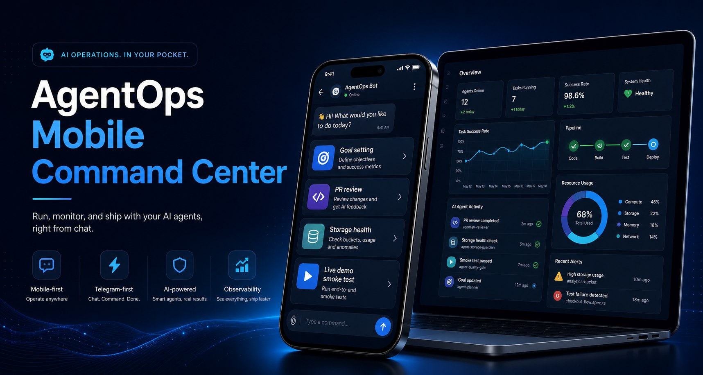
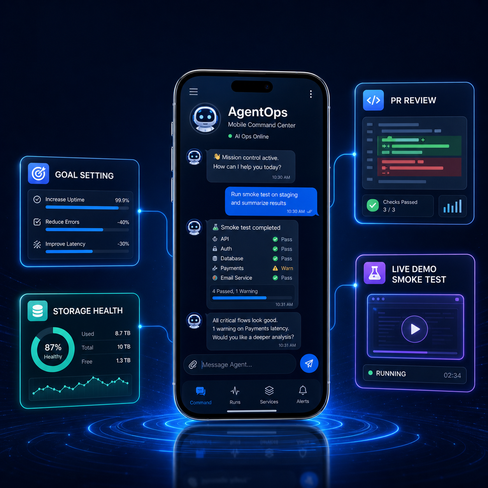

# AgentOps Mobile Command Center

Telegram-first AI agent control room for mobile founders and operators.
Built for **AMD Developer Hackathon: ACT II** with a lightweight MVP focused on:

**Public repo:** https://github.com/djpapzin/agentops-mobile-command-center





**Demo teaser:** [assets/agentops-demo-teaser.mp4](assets/agentops-demo-teaser.mp4)
**Teaser script:** [docs/demo_teaser_script.md](docs/demo_teaser_script.md)
**Demo video:** [assets/agentops-demo-live-screenshots.mp4](assets/agentops-demo-live-screenshots.mp4)
**Archive demo:** [assets/agentops-demo.mp4](assets/agentops-demo.mp4)
**Subtitled demo:** [assets/agentops-demo-subtitled.mp4](assets/agentops-demo-subtitled.mp4)
**Telegram cut:** [assets/agentops-demo-telegram.mp4](assets/agentops-demo-telegram.mp4)
**Submission pack:** [docs/final_submission_pack.md](docs/final_submission_pack.md)

- mobile-first goal control from Telegram
- deterministic routing between local/cheap and remote AMD/Fireworks models
- PR review summaries and safe-to-merge cards
- VM storage health checks
- simple visibility into approvals, recent runs, and system health

## Why this exists

Founders and operators often need to supervise agent workflows while away from a laptop. This project turns Telegram into a control surface for assigning goals, checking status, reviewing pull requests, and approving the next step without opening a desktop IDE.

## What the MVP does

- `/goal` — set or update the active goal
- `/status` — view active goal, pending approvals, and recent runs
- `/storage` — inspect disk usage and health
- `/review_pr` — generate a PR review summary card
- `/approve` — approve the latest decision card
- `/live_demo` — run an explicit live-model smoke test
- demo workflow coverage for PR review, storage health, email triage, and safe-to-merge decisions
- dashboard for recent runs, cost/token estimates, approval backlog, and the live smoke-test button
- optional real Telegram bot polling mode

## Architecture

- **Backend:** FastAPI + SQLite
- **Bot layer:** transport-agnostic Telegram command handler with demo mode plus optional polling bot
- **Routing:** rule-based model router that selects local, Fireworks, or AMD-hosted models by task type, confidence, and accuracy needs
- **Storage:** SQLite event/run log plus lightweight state tables
- **UI:** minimal dashboard rendered from the same API used by the bot
- **Deployment:** Docker + Docker Compose

See [docs/architecture.md](docs/architecture.md) for the system map.

## AMD / Fireworks usage

The demo defaults to local/mock behavior so it is safe to run without secrets.
When you want live integrations, populate `.env` from `.env.example` and wire:

- `FIREWORKS_API_KEY` and `FIREWORKS_BASE_URL` for remote reasoning/summarization tasks
- `AMD_API_KEY` and `AMD_BASE_URL` for AMD-hosted model execution or evaluation
- `TELEGRAM_BOT_TOKEN` for real Telegram polling mode

The live router uses an OpenAI-compatible chat-completions request path and falls back to the demo text whenever credentials or endpoints are unavailable.

## Quick start

```bash
git clone <your-repo>
cd agentops-mobile-command-center
cp .env.example .env
# Use `docker compose up --build` if your Docker install has the compose plugin.
# Fallback: `docker-compose up --build`
docker-compose up --build
```

Open:
- Dashboard: http://localhost:8000
- Health: http://localhost:8000/api/health

## Demo commands

Use the Telegram demo endpoint to simulate mobile operation:

```bash
curl -s http://localhost:8000/api/telegram/demo   -H 'Content-Type: application/json'   -d '{"text":"/goal Ship the hackathon MVP"}' | jq

curl -s http://localhost:8000/api/telegram/demo   -H 'Content-Type: application/json'   -d '{"text":"/status"}' | jq

curl -s http://localhost:8000/api/telegram/demo   -H 'Content-Type: application/json'   -d '{"text":"/review_pr https://github.com/example/repo/pull/42"}' | jq
```

To run a real Telegram polling bot, export `TELEGRAM_BOT_TOKEN` and start:

```bash
python -m app.telegram_bot
```

Or with Docker Compose:

```bash
docker-compose --profile bot up --build
```

For a local-only workflow, you can also call the API directly:

```bash
curl -s http://localhost:8000/api/runs | jq
curl -s http://localhost:8000/api/summary | jq
```

## 2-minute demo script

See [docs/demo_script.md](docs/demo_script.md).

## Submission checklist

See [docs/submission_checklist.md](docs/submission_checklist.md).

## Demo status

The current hackathon demo is **live and verified** as of 2026-06-29:

- `/api/demo/live-demo` returns `live=true`
- Fireworks model routing is wired through `accounts/fireworks/models/kimi-k2p6`
- Docker Compose loads the project `.env`
- Docker image smoke test passes on `127.0.0.1:8011`
- Local tests pass: `16 passed`
- The dashboard includes a live smoke-test button for mobile demo use

Recommended demo path:
1. Open the dashboard
2. Click **Live demo smoke test**
3. Show the returned `live=true` result

## Repo layout

```text
app/
  main.py              FastAPI app, routes, dashboard, and demo Telegram endpoint
  config.py            Environment/config parsing
  db.py                SQLite storage and query helpers
  router.py            Model routing and cost estimates
  demo.py              Mock workflows and command orchestration
  llm.py               OpenAI-compatible live chat client and routed fallback helper
  telegram_bot.py      Optional polling Telegram bot
  templates/index.html Dashboard UI

docs/
  architecture.md
  demo_script.md
  submission_checklist.md

tests/
  test_router.py
  test_demo_commands.py
  test_api.py
  test_telegram_bot.py
```

## Public-readiness notes

- no real secrets committed
- `.env.example` contains placeholders only
- live odds or production services are untouched
- demo data is deterministic and safe for a public repo

## Judging pitch

**AgentOps Mobile Command Center** is a Telegram-native ops console that lets a mobile founder command AI workflows, review code changes, and approve decisions in seconds. The novelty is not another chatbot; it is a compact control plane that routes work to the cheapest capable model, escalates only when accuracy demands it, and makes each decision visible as a mobile-friendly card.

## License

Choose the license that matches your hackathon submission needs before public release.
